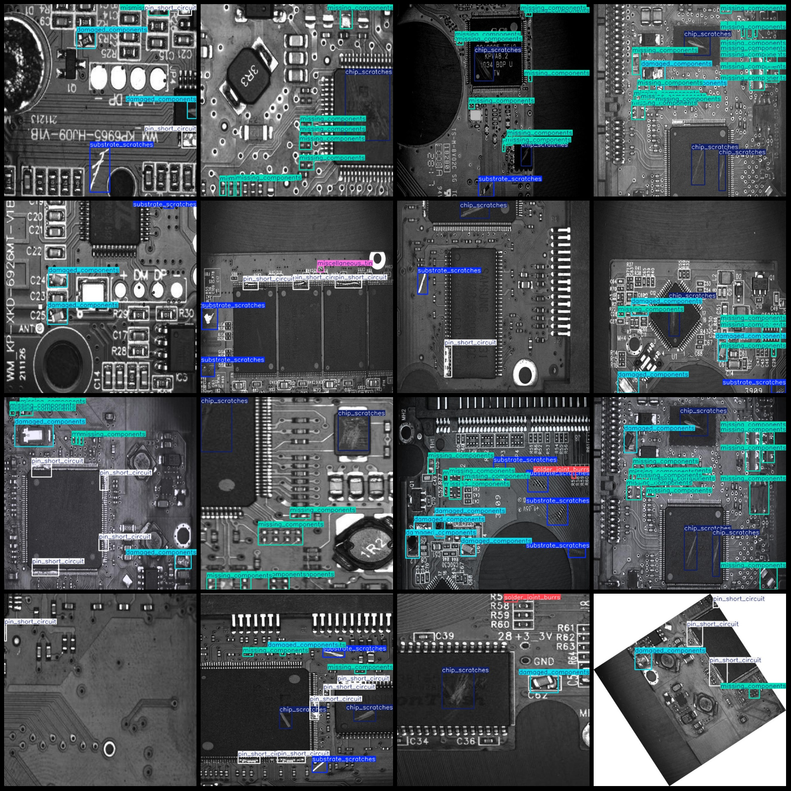
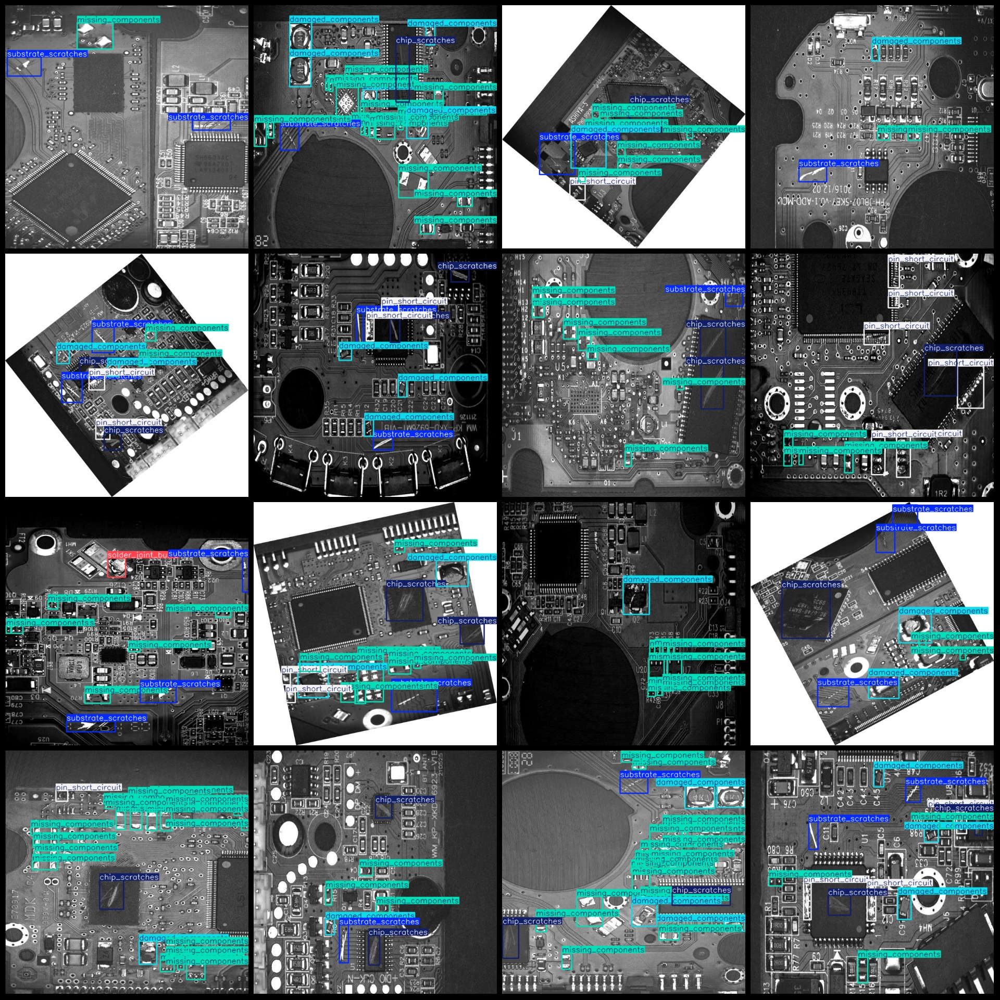

# VOC+YOLO Format: 5954 Images with Enhanced 7-Classifications in PCB Board Defect Detection Dataset

Please note that approximately 600 images in the dataset are original, while the rest are enhanced images, generated at a ratio of 1:9. The dataset follows Pascal VOC format and YOLO format (excluding segmentation paths from the txt file, only containing jpg images and corresponding VOC format xml files and YOLO format txt files).

- Number of images: 5954 images
- Number of annotation counts: 5954.xml files
- Number of annotation counts: 5954.txt files
- Number of categories: 7
- annotation class names:["chip_scratches","damaged_components","miscellaneous_tin","missing_components","pin_short_circuit","solder_joint_burrs","substrate_scratches"]
- boxes per class: 
- chip_scratches=4633 frames
- damaged_components=8464 frames
- miscellaneous_tin=263 frames
- missing_components=35864 frames
- pin_short_circuit=6035 frames
- solder_joint_burrs=258 frames
- substrate_scratches=6822 frames
- total boxes: 62339 frames
- images per class: 
- chip_scratches = 3041 images
The damaged components are 4068 images.
The miscellaneous tin is 249 images.
The missing components are 5284 images.
The pin short circuit is 2884 images.
Solder joint burrs = 251 images
The substrate_scratches function returns 3680 images.
- image resolution: 640x640
- Use annotation tool: labelImg
- Annotation rules: draw a rectangle around the class.
- Important Note: The dataset needs to be split into training, validation, and test sets; these should be done by yourself.
- Special statement: This dataset does not guarantee the accuracy of any trained models or weight files.
- Image preview: Due to the inability to directly provide image previews, you are encouraged to visit the provided link to view the actual images and annotation examples.
## Images

Here is a pay link on Stripe ( https://buy.stripe.com/3cs8yP7sY87d0vu9AB ). Please contact me lonlonago@foxmail.com after funding $89, and I will send you a complete data files , thank you!

